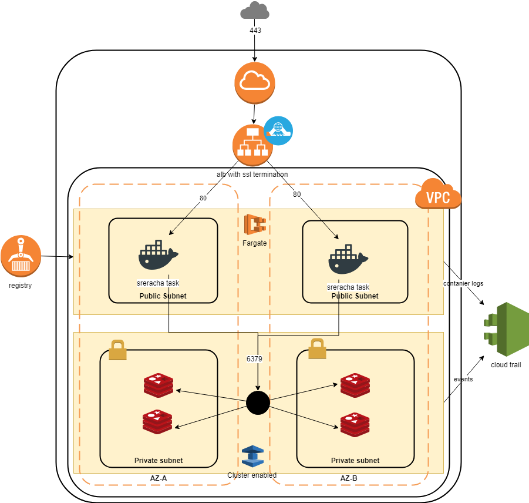
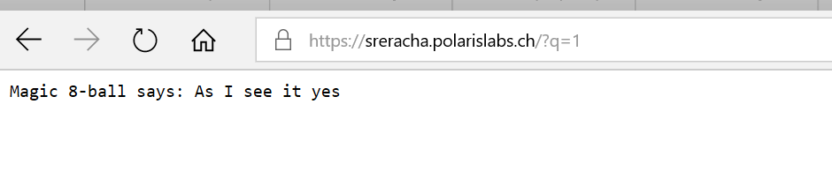
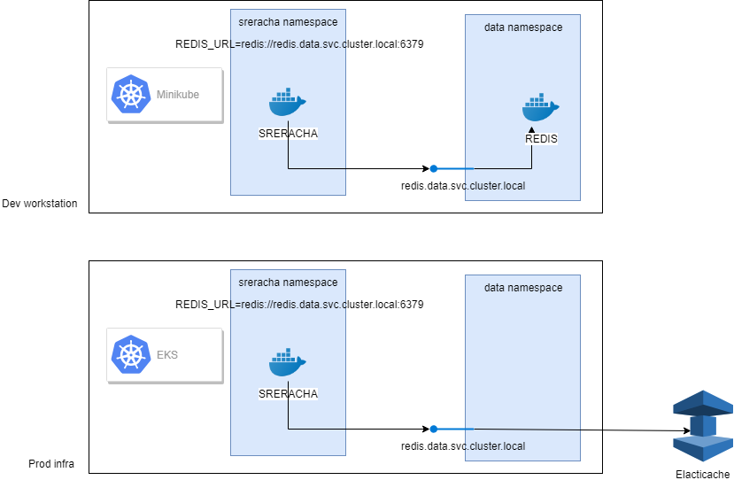

# My terraform proposal #

## AWS authent ##

This set of manifests uses shared authent to connect to AWS. 

In file ~/.aws/credentials
```
[terraform]
aws_access_key_id=ACCESSKEY
aws_secret_access_key=SECRETKEY
```

Refer to [AWS configuration guide for more details](https://docs.aws.amazon.com/cli/latest/userguide/cli-multiple-profiles.html)

## Prerequisites : understanding the app

- app tries to connect to redis with envvar REDIS_URL
- dockerfile to be fixed with missing exec permissions
- image tres to launch app on privileged port as non root user: 
  - Either change www to root (but that's not a good practice for security)
  - Change linux config to allow the app to use a prtected port (prefered)
- App is buggy (wrong fizzbuzz on 15 and 30) and panic after 31, ie around 30 secnds -> stops and need to be restarted to have access to the service : I don't know how to fix that
- Request need to pass a parameter q, value seems not to be important. If not, response 400. 
- Once done, request http://:80?q=1 answers 200 and some random 8-ball messages

## Design notes

- Container running in ECS (Fargate) using Redis from elasticache
- For confidentiality purpose, two subnet levels : one public (hosting ECS), one private (hosting Redis)
- For availability, clustering ECS and Redis on two AZ
- Docker :  need a way to restart the task on ECS with liveness probe as http://:80?q=whatever
- Task listen on port 80 : should implement an ALB, with SSL termination to improve security



### On Redis

- Activate automated failover for HA
- Add replica in cluster to ensure integrity of redis
- encryption at rest and in transit for prod readiness
- Automated upgrade for security patch policy
- Security group : ingress dedicated to processing CIDRs (ECS in that case)

## on ECS

- Container listening on port 80 (http), no need for high memory and CPU
- Need to pass env var REDIS_URL
- / response : status 400. Need to pass a parameter q for 200
- Container fails after 30 seconds : need to restart with healthcheck


## On ALB
- Generate SSL and attach to ALB
- SSL termination : only accet 443 and redirect 80 -> 443
- Same checks as containers (or healthceck on status 400, but not very clean) 

# And finally  



Go to https://sreracha.polarislas.ch/q=1
Sorry for the 503, couldn't get the sreracha app more stable than some outage phases. 

# Improvements to be done

## On the app serracha 
- For sure, this is to be stabilized 
- The app needs to be able to to authent to a secure Redis. Maybe is there an env var such as REDIS_AUTH or REDIS_TOKEN
- Clearly, needs a --help argument to ease the work of SRE

## On the provided HCL 
- ssue with the current redis cluster, got error "you can't write against a read only slave" : maybe due to my lack f expertise on elasticache, I guess that the endpoint URL is to be fixed. 
- Fine tuning of the security groups needs to be done. 
- Send logs to cloudwatch : access logs from ALB, access to Redis, etc... 
- Redirect from http to https. 80 is still open in this HCL. 
- The two containers start at the same time, therefore they stop at the same time. The duration of ECS healthcheck, the time t provision, makes a 503 error until the tasks are running and the ALB is healthy. The two containers should be started at differnt times (know how to do in kubernetes, don't know woth ECS)

# CI/CD

## With ECS (as it has been deployed)

As the infra and the app are initiated by two different persons, I would split the lifecycle of the app from the lifecycle of the infra. 

### App

After creating the infra with terraform, send the information (or the generated manifest) to the junior engineer. Then, create a codepipeline with : 
- codebuild to compile the go app, unit test it, and finally build and push the docker image. 
- codedeploy to deploy in the already provisionned infra, from the previous description json file. 
- I will then trigger some smoke tests like curl actions to have an oversll view of the app

### Infra

The same HCL code can be stored in codecommit, and trigger on changes codebuild pipeline to run `terraform validate` step, and `terraform apply` then. 
The state file shall be remotely stored in a centralised repository like s3 (I have personally used artifactory to store the remote states). 

### Improvement

The point to be improved is that the infra has to be provisionned first to be able to send the redis url back to the developper. I would have proposed another infra that would allow the dev to initiate the changes and deliver to the sre an immutable manifest that can be loaded in an production ready infrastructure, ie with kube.  

## With EKS

I see in this architecture two main benefits : 
- Redis can be mapped  as a kubernetes endpoint, and so, to be abstracted in the manifests : it allows therefore to hardcode the REDIS_UEL envvar inside the manifest.
- Kubernetes can be installed in a single workstation with minikube : it allows the developper to code in his own machine as close as the targeted environment. He can therefore test the deployment manifest before committing (and so launching the pipeline). 
- Based on the two previous, the developer can install a single redis pod, atached to the endpoint, and work on his workstation as close as production. The sreracha manifest can then be resused as is in production stage. The endpoint will abstract the address of local redis or elasticache cluster. The pipeline will then do a `kubectl create` on the prod like infrastructure. 



# About performance tests

Whatever solution is chosen, the container limits have to be set (CPU and memory). Thois has to be determined through some robustness tests (on a single container), the specifications of which are determined by the targeted usage (targeted load, peak or flat, ...). 
Same for redis, to determine not only the size of the nodes, but also the number of replicas to be used to spread the read actions. I would say that even a good old jmeter is enough t perform this kind of load analysis. 
Once the limit of one container is known, the settings are then set in the description, and the number can be determined, allowing even to implement an auto scaling feature to hold potential peaks. 


