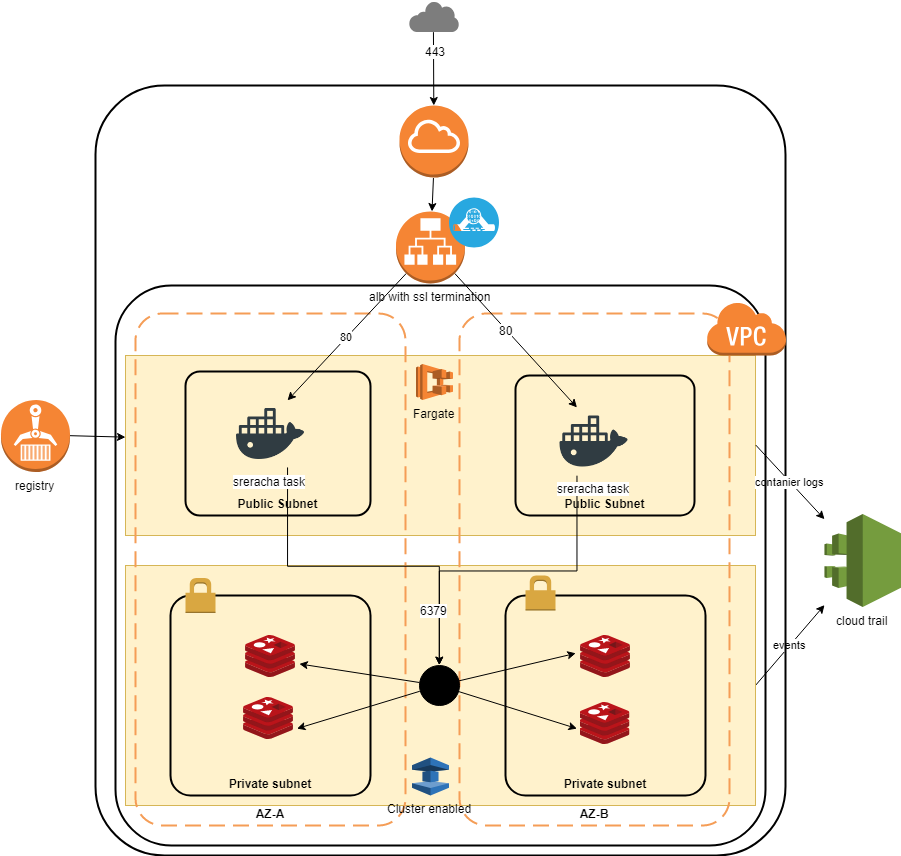

# My terraform proposal #

## AWS authent ##

This set of manifests uses shared authent to connect to AWS. 

In file ~/.aws/credentials
```
[terraform]
aws_access_key_id=ACCESSKEY
aws_secret_access_key=SECRETKEY
```

Refer to [AWS configuration guide for more details](https://docs.aws.amazon.com/cli/latest/userguide/cli-multiple-profiles.html)

## Prerequisites : understanding the app

- app tries to connect to redis with envvar REDIS_URL
- dockerfile to be fixed with missing exec permissions
- image tres to launch app on privileged port as non root user: 
  - Either change www to root (but that's not a good practice for security)
  - Change linux config to allow the app to use a prtected port (prefered)
- App is buggy (wrong fizzbuzz on 15 and 30) and panic after 31 -> stops and need to be restarted to have access to the service : I don't know how to fix that
- Request need to pass a parameter q, value seems not to be important. If not, response 400. 
- Once done, request http://:80?q=1 answers 200 and some random 8-ball messages

## Design notes

- Container running in ECS (Fargate) using Redis from elasticache
- For confidentiality purpose, two subnet levels : one public (hosting ECS), one private (hosting Redis)
- For availability, clustering ECS and Redis on two AZ
- Docker :  need a way to restart the task on ECS with liveness probe as http://:80?q=whatever
- Task listen on port 80 : should implement an ALB, with SSL termination to improve security



### On Redis

- Activate automated failover for HA
- Add replica in cluster to ensure integrity of redis
- encryption at rest and in transit for prod readiness
- Automated upgrade for security patch policy
- Security group : ingress dedicated to processing CIDRs (ECS in that case)
